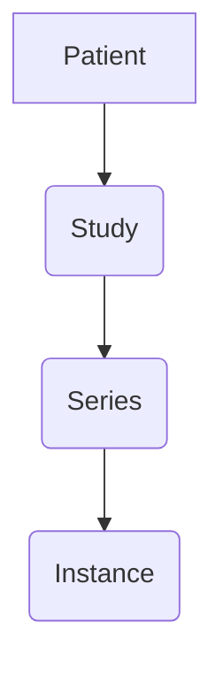

# pydicomsorter

[](https://codecov.io/gh/jjjermiah/PyDicomSorter)
[](https://github.com/jjjermiah/PyDicomSorter/actions/workflows/main.yaml)
[](https://www.codefactor.io/repository/github/jjjermiah/pydicomsorter)

[](https://github.com/prefix-dev/pixi)
[](https://github.com/pre-commit/pre-commit)
[](https://github.com/astral-sh/ruff)
[](https://github.com/squidfunk/mkdocs-material)


[](https://pypi.org/project/pydicomsorter/)
[](https://pypi.org/project/pydicomsorter/)
[](https://pypi.org/project/pydicomsorter/)
[](https://pepy.tech/project/pydicomsorter)


PyDicomSorter is a python package that sorts dicom files into a structured directory based on the dicom tags.

It can be used as a command line tool or as a python package.

## Installation

```bash
pip install PyDicomSorter
```


Testing the pydicom library to sort dicom files by patient name and study date.

> [!NOTE] none of this works yet

Designing should look like:


# DICOM data model

A Patient has one or more Studies, a Study has one or more Series, and a Series has one or more Instances.



<!-- [](https://github.com/anuraghazra/github-readme-stats)

[](https://github.com/jjjermiah/github-readme-stats) -->

<!-- [](https://githubtrends.io) -->
