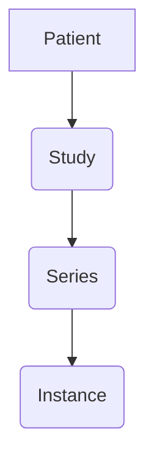

# pydicomsorter

[](https://codecov.io/gh/jjjermiah/PyDicomSorter)
[](https://github.com/jjjermiah/PyDicomSorter/actions/workflows/main.yaml)

[](https://github.com/astral-sh/ruff)
[](https://github.com/squidfunk/mkdocs-material)

[](https://pypi.org/project/pydicomsorter/)
[](https://pypi.org/project/pydicomsorter/)
[](https://github.com/prefix-dev/pixi)

Testing the pydicom library to sort dicom files by patient name and study date.

> WARNING: This is a work in progress and is not implemented.

Designing should look like:

``` bash
Usage: dicomsort [OPTIONS] SOURCEDIR DESTINATION_DIR

╭─ Advanced options ───────────────────────────────────────────────────────────────╮
│ --delete_source  -d    Delete the source files after sorting.                    │
│ --keep_going     -k    Keep going when an error occurs.                          │
│ --symlink        -s    Create symbolic links instead of moving files.            │
│ --dry_run        -n    Do not move or copy files, just print what would be done. │
╰──────────────────────────────────────────────────────────────────────────────────╯
╭─ Basic options ──────────────────────────────────────────────────────────────────╮
│ --verbose        Print verbose output.                                           │
│ --debug          Print debug output.                                             │
│ --help     -h    Show this message and exit.                                     │
╰──────────────────────────────────────────────────────────────────────────────────╯
```

# DICOM data model

A Patient has one or more Studies, a Study has one or more Series, and a Series has one or more Instances.



<!-- [](https://github.com/anuraghazra/github-readme-stats)

[](https://github.com/jjjermiah/github-readme-stats) -->

<!-- [](https://githubtrends.io) -->
