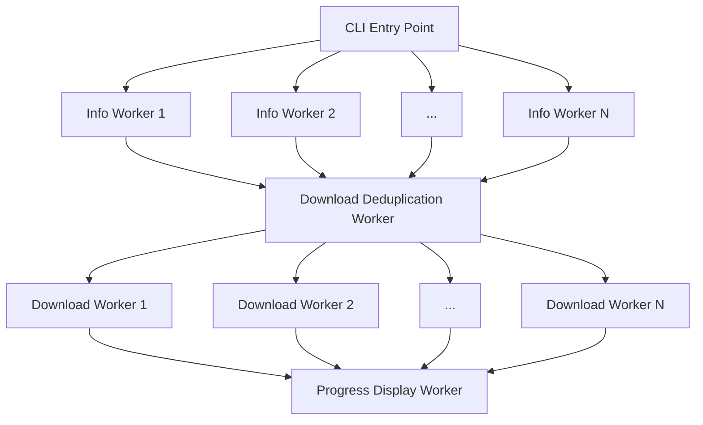

# yt-dlpp
A thin wrapper around [`yt-dlp`](https://github.com/yt-dlp/yt-dlp) for parallel downloads

## Description

`yt-dlpp` is just `yt-dlp` but starts downloads in parallel.   
It supports passing multiple download URLs and unwrapping playlists.

## Installation

Note: In addition to `yt-dlpp`, it is expected that you also have a valid `yt-dlp` install available in the command line.  
Only Linux has been tested and validated, but feel free to open a PR to add support for other OS-es. 

### From pypi

```sh
pip install yt-dlpp
```


### From source, on Linux

```sh
git clone https://github.com/GeoffreyCoulaud/yt-dlpp.git
cd yt-dlpp
python3 -m venv .venv
source .venv/bin/activate
pip install
```

## Usage

`yt-dlpp` accepts all valid `yt-dlp` arguments and passes them mostly intact.  
However, arguments related to CLI output will be ignored since that is handled by `yt-dlpp`.

Below, you can find a short list of the added arguments:

| Argument | Description | Default value |
| - | - | - |
| `--n-info-workers` | Number concurrent url info extraction workers | Number of CPUs in the system |
| `--n-dl-workers` | Number concurrent download workers | Number of CPUs in the system |

## Architecture

`yt-dlpp` spreads the info getting and downloads to multiple worker processes. Here is an architecture overview of the project :



## Reason to exist

As you may be aware, starting multiple Youtube downloads in parallel will probably not change the overall time taken, since a rate limit is in place, and before reaching it, you may simply reach your ISP's limit.  
But `yt-dlp` (and therefore `yt-dlpp` too) is not only used for Youtube! Other websites have different restrictions, and some may simply allow downloads at a slow speed, but no per IP throttling (eg. NHK World Japan).

